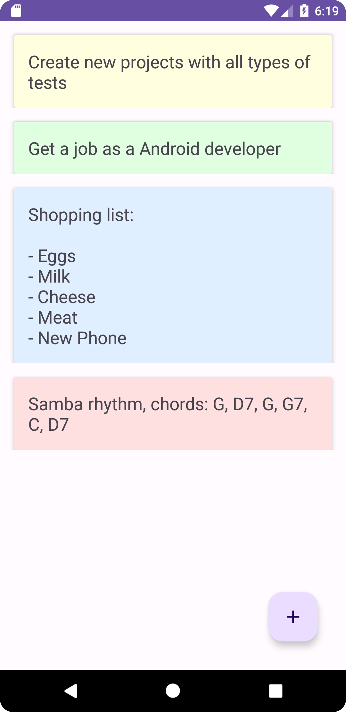
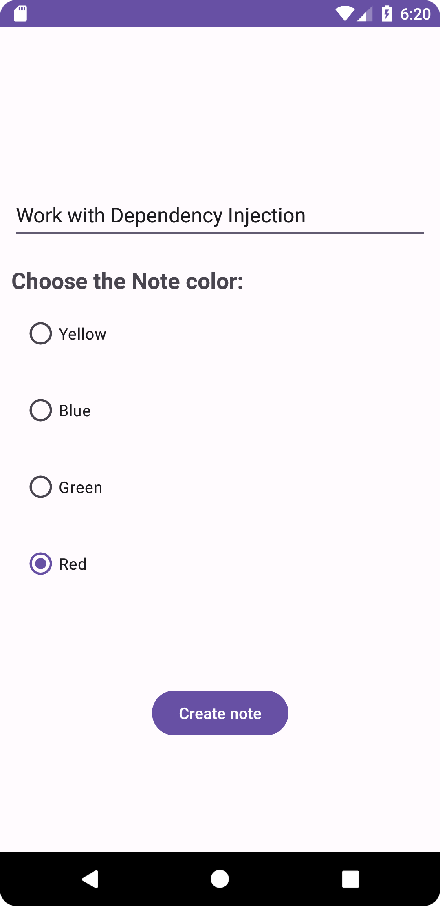
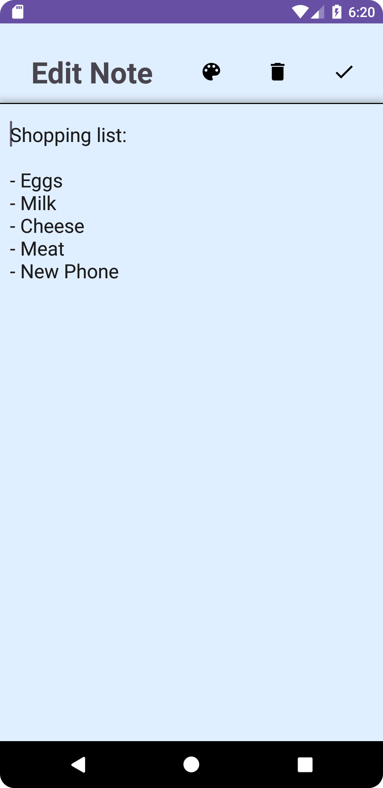

<h1 align="center">Notes App</h1>

<p align="center">
  <a href="https://opensource.org/licenses/Apache-2.0"></a>
  <a href="https://android-arsenal.com/api"> </a>

  <br>
  <a href="https://wa.me/+5521990399627"></a>
  <a href="https://www.linkedin.com/in/vinicius-santos-b217b5168/"></a>
  <a href="mailto:viniciusantos0898@gmail.com"></a>
</p>

<p align="center">  
  
📖 This project was created to display my tech knowledge in native Android development with Kotlin. More techincal info below.

Notes App is a native Android App made with Kotlin. The app is capable of doing CRUD(Create, Read, Update and Delete) operations thanks to Room (SQLite Database); displaying the data (LiveData) in Note cards, inside a Recycler View; maintaining the model and view separation with MVVM and utilizing Clean Architecture and SOLID patterns to make the code clean, reusable and decoupled.
</p>

</br>

<p float="left" align="center">
  
  
  
</p>

## Download

<a href='https://play.google.com/store/apps/details?id=com.n0stalgiaultra.notesapp'></a>

Download the <a href="https://github.com/N0stalgiaUltra/NotesApp/tree/main/apk">APK</a> directly from this repo. You can check out <a href="https://www.google.com/search?q=how+to+install+apk+in+android">here</a> how to install an APK to your Android device.

## Tech Stack

- Minimum SDK Level 25
- <a href="https://kotlinlang.org/">Kotlin</a>

- [Jetpack](https://developer.android.com/jetpack?hl=pt-br)
  - Live Data: Used for observe data from a reactive point of view. Allowing the data used in UI to be updated automatically.
  - Lifecycle: Observe the Android lifecycle and manipulate the states from the UI after the lifecycle change.
  - ViewModel: Used to retrieve the data from the Model layer and update the data from View.
  - ViewBinding: Manages the XML layout views in Kotlin through a class.
  - Recycler View: Show a more efficient way of displaying a list of Views in the screen, recycling the views for better performance.
  - Room: The persistency library that offers a abstraction layer on top of SQLite to allow for a more robust database access.
    
- Architecture
  - MVVM (Model-View-ViewModel) + Clean Architecture: The first item is used to separate the logic of the app's UI, helping with testability and organization; also, the Clean Architecture helps to build the app's main system with well designed layers, who work with independency, facilitating with the scalability and maintenance.
  - Repository pattern: This pattern help with the data layer´s abstraction

- Libraries  
  - [Koin](https://insert-koin.io/): Used for Dependency Injection
  - [Junit](https://junit.org/junit5/) + [Mockito](https://site.mockito.org/): Used to create and run unit tests
  - [Espresso](https://developer.android.com/training/testing/espresso?hl=pt-br): Used to create and run instrumented/UI tests

## Architecture
**NotesApp** was built using MVVM, Clean Architecture and the Repository pattern. Following [Google´s official recomendation](https://developer.android.com/topic/architecture)
</br>

## Features

### Notes Listing


List all the created notes stored in the database. The list was created with CardView, Constraint Layout and Recycler View.


### Add Note


Users can add as many notes as they want, specifying the text and the preferred color. This activity was created with Constraint Layout and Radio Group

### Edit/Remove Note


Users also have the possibility to edit their notes, changing the text and color. Also, there´s a possibility to delete the note. Activity created with TopBar, Icon Buttons, Radio Group. 


# License
```xml

Licensed under the Apache License, Version 2.0 (the "License");
you may not use this file except in compliance with the License.
You may obtain a copy of the License at

   http://www.apache.org/licenses/LICENSE-2.0

Unless required by applicable law or agreed to in writing, software
distributed under the License is distributed on an "AS IS" BASIS,
WITHOUT WARRANTIES OR CONDITIONS OF ANY KIND, either express or implied.
See the License for the specific language governing permissions and
limitations under the License.
```

# Privacy Policy

```html 
Privacy Policy
Your privacy is important to us. It is Simple Notes's policy to respect your privacy regarding any information we may collect from you across our website, Simple Notes, and other sites we own and operate.

We only ask for personal information when we truly need it to provide a service to you. We collect it by fair and lawful means, with your knowledge and consent. We also let you know why we’re collecting it and how it will be used.

We only retain collected information for as long as necessary to provide you with your requested service. What data we store, we’ll protect within commercially acceptable means to prevent loss and theft, as well as unauthorised access, disclosure, copying, use or modification.

We don’t share any personally identifying information publicly or with third-parties, except when required to by law.

Our website may link to external sites that are not operated by us. Please be aware that we have no control over the content and practices of these sites, and cannot accept responsibility or liability for their respective privacy policies.

You are free to refuse our request for your personal information, with the understanding that we may be unable to provide you with some of your desired services.

Your continued use of our website will be regarded as acceptance of our practices around privacy and personal information. If you have any questions about how we handle user data and personal information, feel free to contact us.

More Information
Hopefully that has clarified things for you and as was previously mentioned if there is something that you aren't sure whether you need or not it's usually safer to leave cookies enabled in case it does interact with one of the features you use on our site.

This policy is effective as of Sep 2023.
```

